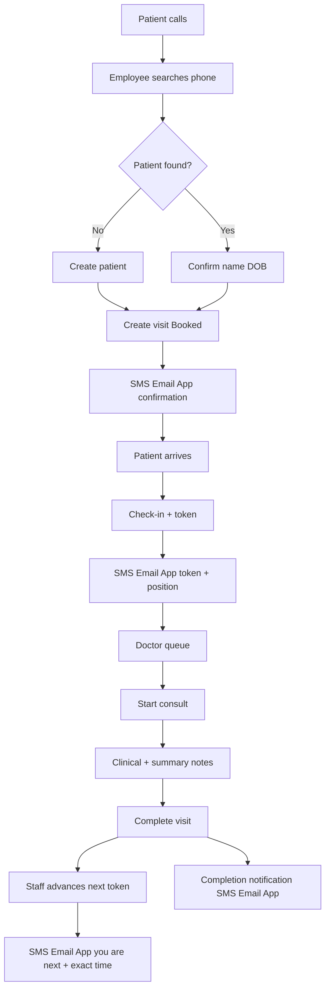
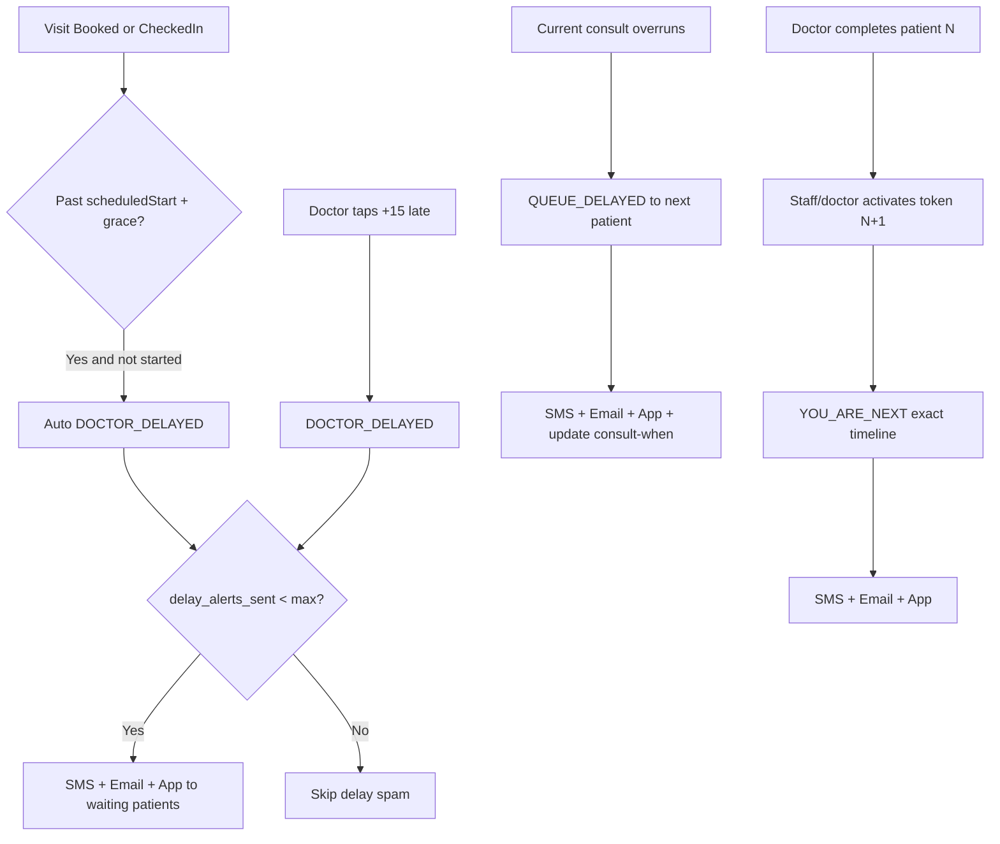

# UX Flows — Call to Consult (MVP Wireframes)

Text wireframes for Employee, Doctor, and Patient. Goal: speed for staff, calm status for patients, minimal typing for doctors.

---

## 1. Employee — Phone call intake

```
┌─────────────────────────────────────────────────────────┐
|  Clinic Desk                          [Employee] [Logout]|
├─────────────────────────────────────────────────────────┤
|  Patient phone                                           |
|  ┌───────────────────────────────────┐  ┌────────────┐  |
|  | +91 98XXX XXXXX                   |  |  Search    |  |
|  └───────────────────────────────────┘  └────────────┘  |
|                                                          |
|  Recent callers (today)                                  |
|  • 98765… — Anita Sharma — 10:02 — Booked                |
|  • 91234… — Ravi Kumar  — 09:41 — Checked in             |
└─────────────────────────────────────────────────────────┘
```

**Flow**

1. Call arrives → employee types phone → Search.  
2. If matches → **Patient match** screen.  
3. If none → **Create patient** then **Create visit**.

### Patient match (shared phone / family)

```
┌─────────────────────────────────────────────────────────┐
|  Matches for 98765XXXXX                    [New patient]|
├─────────────────────────────────────────────────────────┤
|  ( ) Anita Sharma   DOB 12-Mar-1988   Female             |
|  ( ) Rohan Sharma   DOB 04-Jul-2015   Male               |
|                                                          |
|  Confirm selected → [Create visit]                       |
└─────────────────────────────────────────────────────────┘
```

**Rule:** Always confirm name + DOB before linking a visit (wrong-patient risk).

### Create visit

```
┌─────────────────────────────────────────────────────────┐
|  New visit — Anita Sharma (98765XXXXX)                   |
├─────────────────────────────────────────────────────────┤
|  Department [General Medicine ▼]                         |
|  Doctor     [Dr. Mehta ▼]                                |
|  Slot       [Today 14:30–14:45 ▼]                        |
|  Reason     [Fever, 2 days________________]              |
|  Staff note [Needs wheelchair____________]               |
|                                                          |
|  Status on save: (•) Booked  ( ) Called (intake only)    |
|                                                          |
|  [Cancel]                         [Save & notify patient]|
└─────────────────────────────────────────────────────────┘
```

After save: confirmation SMS/email queued; timeline event `STATUS_CHANGE → BOOKED`.

### Visit detail / check-in

```
┌─────────────────────────────────────────────────────────┐
|  Visit #A12F — Anita Sharma          Status: BOOKED      |
|  Dr. Mehta · Token: — · Scheduled 14:30                  |
├─────────────────────────────────────────────────────────┤
|  Actions: [Check in & issue token] [Mark late] [Cancel]  |
|                                                          |
|  Timeline                                                |
|  10:05  CALLED→BOOKED by Priya (employee)                |
|  10:05  Notification BOOKING_CONFIRMED queued (SMS)      |
|  14:12  →CHECKED_IN token=14                             |
└─────────────────────────────────────────────────────────┘
```

---

## 2. Doctor — Today’s queue

```
┌─────────────────────────────────────────────────────────┐
|  Dr. Mehta — Today                    Delayed: ON / OFF  |
├─────────────────────────────────────────────────────────┤
|  NOW   #14  Anita Sharma   CHECKED_IN   wait 18m  [Start]|
|  NEXT  #15  Ravi Kumar     CHECKED_IN   wait 5m          |
|        #16  Meera Joshi    BOOKED       15:00            |
|                                                          |
|  [+15 min late — notify waiting patients]                |
└─────────────────────────────────────────────────────────┘
```

### Consult panel

```
┌─────────────────────────────────────────────────────────┐
|  #14 Anita Sharma · 36F · DOB 12-Mar-1988                |
|  Reason: Fever, 2 days                                   |
├─────────────────────────────────────────────────────────┤
|  [Start consult]  [+15 late]  [Complete]                 |
|                                                          |
|  Clinical notes (not fully visible to patient)           |
|  ┌─────────────────────────────────────────────────────┐ |
|  | Complaint: …                                        | |
|  | Advice: …                                           | |
|  └─────────────────────────────────────────────────────┘ |
|  Patient-visible summary (optional)                      |
|  ┌─────────────────────────────────────────────────────┐ |
|  | Rest, fluids; follow up in 3 days                   | |
|  └─────────────────────────────────────────────────────┘ |
└─────────────────────────────────────────────────────────┘
```

---

## 3. Patient — Status window (OTP login)

Patient window always shows **doctor name**, **fixed appointment time**, **token number**, **when consult is possible**, live status, and a patient-safe timeline. Updates arrive via SMS + Email + in-app.

```
┌─────────────────────────────────────────────────────────┐
|  My visit                                   [Logout]    |
├─────────────────────────────────────────────────────────┤
|  Doctor         Dr. Mehta                               |
|  Appointment    Today 14:30  (fixed slot)               |
|  Token          14                                      |
|  Consult when   ~15:05–15:20  (live ETA)                |
|  Status         Waiting · Doctor running ~15 min late   |
|  Updated        1 min ago                               |
|                                                         |
|  Timeline                                               |
|  10:05  Booked — confirmation sent                      |
|  14:12  Checked in — token 14                           |
|  14:40  Doctor delayed ~15 min — notified               |
|  15:02  Previous patient done — you’re next             |
|                                                         |
|  [Refresh]                                              |
└─────────────────────────────────────────────────────────┘
```

| Field | Rule |
|-------|------|
| Doctor name | From assigned doctor; update if staff reassigns |
| Fixed time | Always show `scheduled_start`; never hide when delayed |
| Token | “—” until check-in; then issued slip number |
| Consult when | Before check-in = slot time; after = queue ETA + delays |
| Timeline | Patient-safe events only (no full clinical notes) |

**OTP login**

```
Phone → Send OTP → Enter 6-digit code → My visits
```

Patients never see other patients’ data or full clinical notes.

---

## 4. End-to-end happy path



### Delay + long consult path



---

## 5. UX principles (do not violate)

| Role | Principle |
|------|-----------|
| Employee | One big phone field; ≤3 clicks to book; advance next token after each complete |
| Doctor | Queue-first; Start / Late / Complete primary |
| Patient | Doctor + fixed time + token + consult-when always visible; timeline matches notifications |
| All | Every important action leaves a timeline event and notifies SMS + Email + App |
